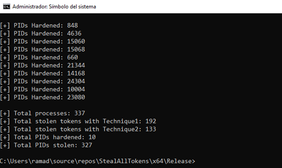

# StealAllTokens
This PoC uses two diferent technics for stealing the primary token from all running processes, showing that is possible to impersonate and use whatever token present at any process

# Blogpost

# Credits
* https://posts.specterops.io/understanding-and-defending-against-access-token-theft-finding-alternatives-to-winlogon-exe-80696c8a73b
* https://github.com/lab52io/StopDefender
* https://www.mcafee.com/enterprise/en-us/assets/reports/rp-access-token-theft-manipulation-attacks.pdf
* http://undocumented.ntinternals.net/index.html?page=UserMode%2FUndocumented%20Functions%2FNT%20Objects%2FThread%2FNtImpersonateThread.html
* https://googleprojectzero.blogspot.com/2016/03/exploiting-leaked-thread-handle.html
