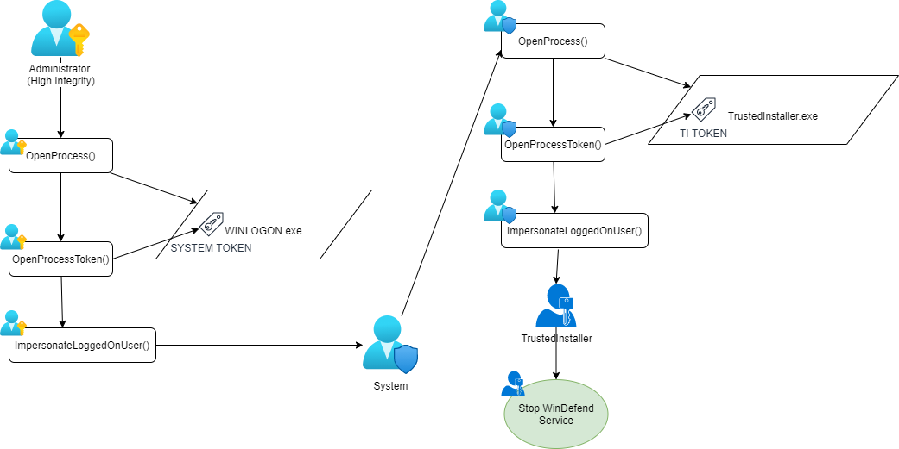
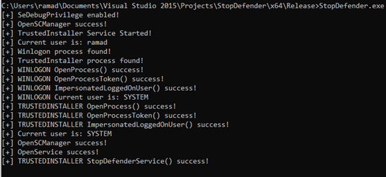

# StopDefender
Stop Windows Defender programmatically using Steal token from TrustedInstaller and winlogon processes.

One button stop action, no need for supply commandline options nor pid. Usefull for integration with Post Explotation frameworks.

# Blogpost
https://www.securityartwork.es/2021/09/27/trustedinstaller-parando-windows-defender/

# Credits
* https://github.com/slyd0g/PrimaryTokenTheft
* https://posts.specterops.io/understanding-and-defending-against-access-token-theft-finding-alternatives-to-winlogon-exe-80696c8a73b
* https://www.tiraniddo.dev/2017/08/the-art-of-becoming-trustedinstaller.html
* https://docs.microsoft.com/en-us/windows/win32/com/impersonation-levels
* https://halove23.blogspot.com/2021/08/executing-code-in-context-of-trusted.html
* https://docs.microsoft.com/es-es/windows/win32/api/winsvc/ns-winsvc-service_sid_info?redirectedfrom=MSDN
