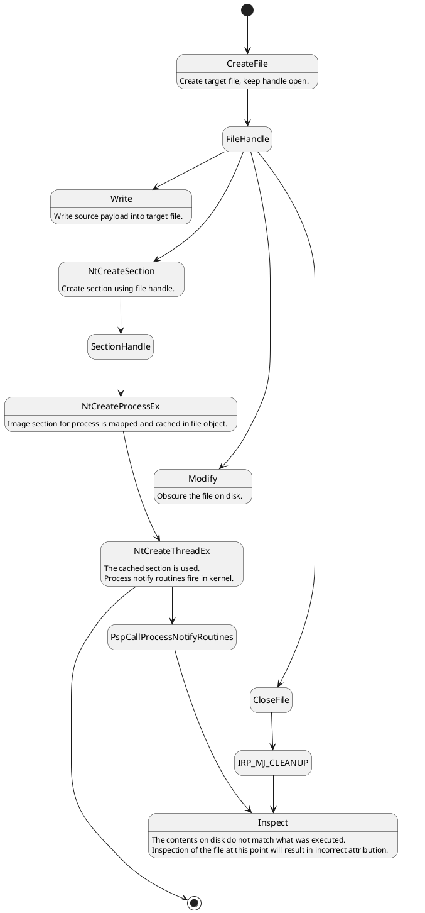

# Process Herpaderping 
[][png.HerpaderpIcon]
Process Herpaderping is a method of obscuring the intentions of a process by 
modifying the content on disk after the image has been mapped. This results 
in curious behavior by security products and the OS itself.

![][png.mimioogle]

![][gif.SurivDemo]

## Summary
Generally, a security product takes action on process creation by registering a 
callback in the Windows Kernel 
([PsSetCreateProcessNotifyRoutineEx][msdn.PsSetCreateProcessNotifyRoutineEx]). 
At this point, a security product may inspect the file that was used to map 
the executable and determine if this process should be allowed to execute. This 
kernel callback is invoked when the initial thread is inserted, not when the 
process object is created. 

Because of this, an actor can create and map a process, modify the content of 
the file, then create the initial thread. A product that does inspection at the 
creation callback would see the modified content. Additionally, some products 
use an on-write scanning approach which consists of monitoring for file writes. 
A familiar optimization here is recording the file has been written to and 
defer the actual inspection until [IRP_MJ_CLEANUP][msdn.IRP_MJ_CLEANUP] 
occurs (e.g. the file handle is closed). Thus, an actor using a 
`write -> map -> modify -> execute -> close` workflow will subvert on-write scanning 
that solely relies on inspection at [IRP_MJ_CLEANUP][msdn.IRP_MJ_CLEANUP].

To abuse this convention, we first write a binary to a target file on disk. 
Then, we map an image of the target file and provide it to the OS to use for 
process creation. The OS kindly maps the original binary for us. Using 
the existing file handle, and before creating the initial thread, we modify the 
target file content to obscure or fake the file backing the image. Some time later, 
we create the initial thread to begin execution of the original binary. Finally, we 
 will close the target file handle. Let's walk through this step-by-step:
1. Write target binary to disk, keeping the handle open. This is what will 
   execute in memory.
2. Map the file as an image section ([NtCreateSection][msdn.NtCreateSection], 
   [SEC_IMAGE][msdn.SEC_IMAGE]).
3. Create the process object using the section handle (`NtCreateProcessEx`).
4. Using the same target file handle, obscure the file on disk.
5. Create the initial thread in the process (`NtCreateThreadEx`).
    - At this point the process creation callback in the kernel will fire. The 
      contents on disk do not match what was mapped. Inspection of the file at 
      this point will result in incorrect attribution.
6. Close the handle. [IRP_MJ_CLEANUP][msdn.IRP_MJ_CLEANUP] will occur here.
    - Since we've hidden the contents of what is executing, inspection at this 
      point will result in incorrect attribution.

![][svg.StateDiagram]
<details>
    <summary>plantuml</summary>
<p>



</p>
</details>

## Behavior
You'll see in the demo below, `CMD.exe` is used as the execution target. The 
first run overwrites the bytes on disk with a pattern. The second run overwrites 
`CMD.exe` with `ProcessHacker.exe`. The Herpaderping tool fixes up the binary to 
look as close to `ProcessHacker.exe` as possible, even retaining the original 
signature. Note the multiple executions of the same binary and how the process 
looks to the user compared to what is in the file on disk.

![][gif.ProcessHerpaderp]

![][png.procmon]

### Diving Deeper <a name="tag-diving-deeper"></a>
We've observed the behavior and some of this may be surprising. Let's try to 
explain this behavior.

[Technical Deep Dive][md.DivingDeeper]

## Background and Motivation
When designing products for securing Windows platforms, many engineers in 
this field (myself included) have fallen on preconceived notions with respect 
to how the OS will handle data. In this scenario, some might expect the file on 
disk to remain "locked" when the process is created. You can't delete the file. 
You can't write to it. But you can rename it. Seen here, under the right 
conditions, you can in fact write to it. Remain vigilant on your assumptions, 
always question them, and do your research.

The motivation for this research came about when discovering how to do analysis 
when a file is written. With prior background researching process Hollowing and 
Doppelganging, I had theorized this might be possible. The goal is to provide 
better security. You cannot create a better lock without first understanding 
how to break the old one.

### Similar Techniques
Herpaderping is similar to Hollowing and Doppelganging however there are some 
key differences:

#### Process Hollowing
Process Hollowing involves modifying the mapped section before execution 
begins, which abstractly this looks like: `map -> modify section -> execute`. This workflow 
results in the intended execution flow of the Hollowed process diverging into 
unintended code. Doppelganging might be considered a form of Hollowing. 
However, Hollowing, in my opinion, is closer to injection in that Hollowing 
usually involves an explicit write to the already mapped code. This differs 
from Herpaderping where there are no modified sections.

#### Process Doppelganging
Process Doppelganging is closer to Herpaderping. Doppelganging abuses 
transacted file operations and generally involves these steps: 
`transact -> write -> map -> rollback -> execute`. 
In this workflow, the OS will create the image section and account for 
transactions, so the cached image section ends up being what you wrote to the 
transaction. The OS has patched this technique. Well, they patched the crash it caused. 
Maybe they consider this a "legal" use of a transaction. Thankfully, Windows 
Defender does catch the Doppelganging technique. Doppelganging differs from 
Herpaderping in that Herpaderping does not rely on transacted file operations. 
And Defender doesn't catch Herpaderping.

#### Comparison
For reference, the generalized techniques: 

| Type          | Technique                                         |
| :------------ | :------------------------------------------------ |
| Hollowing     | `map -> modify section -> execute`                |
| Doppelganging | `transact -> write -> map -> rollback -> execute` |
| Herpaderping  | `write -> map -> modify -> execute -> close`      |

We can see the differences laid out here. While Herpaderping is arguably 
noisier than Doppelganging, in that the malicious bits do hit the disk, we've 
seen that security products are still incapable of detecting Herpaderping. 

## Possible Solution
There is not a clear fix here. It seems reasonable that preventing an image 
section from being mapped/cached when there is write access to the file 
should close the hole. However, that may or may not be a practical solution.

Another option might be to flush the changes to the file through to the cached 
image section if it hasn't yet been mapped into a process. However, since the 
map into the new process occurs at `NtCreateProcess` that is probably not a 
viable solution.

From a detection standpoint, there is not a great way to identify the actual 
bits that got mapped, inspection at [IRP_MJ_CLEANUP][msdn.IRP_MJ_CLEANUP] or 
a callback registered at 
[PsSetCreateProcessNotifyRoutineEx][msdn.PsSetCreateProcessNotifyRoutineEx] 
results in incorrect attribution since the bits on disk have been changed, you 
would have to rebuild the file from the section that got created. It's worth 
pointing out here there is a new callback in Windows 10 you may register for 
[PsSetCreateProcessNotifyRoutineEx2][msdn.PsSetCreateProcessNotifyRoutineEx2] 
however this suffers from the same problem as the previous callback, it's 
called out when the initial thread is executed, not when the process object is 
created. Microsoft did add 
[PsSetCreateThreadNotifyRoutineEx][msdn.PsSetCreateThreadNotifyRoutineEx] which 
is called out when the initial thread is inserted if registered with 
[PsCreateThreadNotifyNonSystem][msdn.PSCREATETHREADNOTIFYTYPE], opposed to when 
it is about to begin execution (as the old callback did). Extending 
[PSCREATEPROCESSNOTIFYTYPE][msdn.PSCREATEPROCESSNOTIFYTYPE] to be called out 
when the process object is created won't help either, we've seen in the 
[Diving Deeper](#tag-diving-deeper) section that the image section object is 
cached on the [NtCreateSection][msdn.NtCreateSection] call not 
`NtCreateProcess`.

We can't easily identify what got executed. We're left with trying to detect 
the exploitive behavior by the actor, I'll leave discovery of the behavior 
indicators as an exercise for the reader.

## Known Affected Platforms
Below is a list of products and Windows OSes that have been tested as of 
(8/31/2020). Tests were carried out with a known malicious binary.

| Operating System                    | Version         | Vulnerable |
| :---------------------------------- | :-------------- | :--------: |
| Windows 7 Enterprise x86            | 6.1.7601        | Yes        |
| Windows 10 Pro x64                  | 10.0.18363.900  | Yes        |
| Windows 10 Pro Insider Preview x64  | 10.0.20170.1000 | Yes        |
| Windows 10 Pro Insider Preview x64  | 10.0.20201.1000 | Yes        |

| Security Product                    | Version       | Vulnerable |
| :---------------------------------- | :------------ | :--------: |
| Windows Defender AntiMalware Client | 4.18.2006.10  | Yes        |
| Windows Defender Engine             | 1.1.17200.2   | Yes        |
| Windows Defender Antivirus          | 1.319.1127.0  | Yes        |
| Windows Defender Antispyware        | 1.319.1127.0  | Yes        |
| Windows Defender AntiMalware Client | 4.18.2007.6   | Yes        |
| Windows Defender Engine             | 1.1.17300.2   | Yes        |
| Windows Defender Antivirus          | 1.319.1676.0  | Yes        |
| Windows Defender Antispyware        | 1.319.1676.0  | Yes        |
| Windows Defender AntiMalware Client | 4.18.2007.8   | Yes        |
| Windows Defender Engine             | 1.1.17400.5   | Yes        |
| Windows Defender Antivirus          | 1.323.267.0   | Yes        |
| Windows Defender Antispyware        | 1.323.267.0   | Yes        |

## Responsible Disclosure
This vulnerability was disclosed to the Microsoft Security Response Center 
(MSRC) on 7/17/2020 and a case was opened by MSRC on 7/22/2020. MSRC concluded 
their investigation on 8/25/2020 and determined the findings are valid but do 
not meet their bar for immediate servicing. At this time their case is closed, 
without resolution, and is marked for future review, with no timeline.

We disagree on the severity of this bug; this was communicated to MSRC on 
8/27/2020. 
1. There are similar vulnerabilities in this class (Hollowing and 
Doppelganging). 
1. The vulnerability is shown to defeat security features inherent to the 
OS (Windows Defender).
1. The vulnerability allows an actor to gain execution of arbitrary code.
1. The user is not notified of the execution of unintended code.
1. The process information presented to the user does not accurately reflect 
what is executing. 
1. Facilities to accurately identify the process are not intuitive or 
incorrect, even from the kernel. 


# Source 
This repo contains a tool for exercising the Herpaderping method of process 
obfuscation. Usage is as follows:
```
Process Herpaderping Tool - Copyright (c) Johnny Shaw
ProcessHerpaderping.exe SourceFile TargetFile [ReplacedWith] [Options...]
Usage:
  SourceFile               Source file to execute.
  TargetFile               Target file to execute the source from.
  ReplacedWith             File to replace the target with. Optional,
                           default overwrites the binary with a pattern.
  -h,--help                Prints tool usage.
  -d,--do-not-wait         Does not wait for spawned process to exit,
                           default waits.
  -l,--logging-mask number Specifies the logging mask, defaults to full
                           logging.
                               0x1   Successes
                               0x2   Informational
                               0x4   Warnings
                               0x8   Errors
                               0x10  Contextual
  -q,--quiet               Runs quietly, overrides logging mask, no title.
  -r,--random-obfuscation  Uses random bytes rather than a pattern for
                           file obfuscation.
  -e,--exclusive           Target file is created with exclusive access and
                           the handle is held open as long as possible.
                           Without this option the handle has full share
                           access and is closed as soon as possible.
  -u,--do-not-flush-file   Does not flush file after overwrite.
  -c,--close-file-early    Closes file before thread creation (before the
                           process notify callback fires in the kernel).
                           Not valid with "--exclusive" option.
  -k,--kill                Terminates the spawned process regardless of
                           success or failure, this is useful in some
                           automation environments. Forces "--do-not-wait
                           option.
```

## Cloning and Building
The repo uses submodules, after cloning be sure to init and update the 
submodules. Projects files are targeted to Visual Studio 2019.
```
git clone https://github.com/jxy-s/herpaderping.git
cd .\herpaderping\
git submodule update --init --recursive
MSBuild .\herpaderping.sln
```

## Credits
The following are used without modification. Credits to their authors.
- [Windows Implementation Libraries (WIL)][github.wil]  
A header-only C++ library created to make life easier for developers on Windows 
through readable type-safe C++ interfaces for common Windows coding patterns.  
- [Process Hacker Native API Headers][github.phnt]   
Collection of Native API header files. Gathered from Microsoft header files and 
symbol files, as well as a lot of reverse engineering and guessing.

[//]: # (Hyperlink IDs)
[github.wil]: https://github.com/microsoft/wil
[github.phnt]: https://github.com/processhacker/phnt
[msdn.PsSetCreateProcessNotifyRoutineEx]: https://docs.microsoft.com/en-us/windows-hardware/drivers/ddi/ntddk/nf-ntddk-pssetcreateprocessnotifyroutineex
[msdn.PsSetCreateProcessNotifyRoutineEx2]: https://docs.microsoft.com/en-us/windows-hardware/drivers/ddi/ntddk/nf-ntddk-pssetcreateprocessnotifyroutineex2
[msdn.PsSetCreateThreadNotifyRoutineEx]: https://docs.microsoft.com/en-us/windows-hardware/drivers/ddi/ntddk/nf-ntddk-pssetcreatethreadnotifyroutineex
[msdn.PSCREATETHREADNOTIFYTYPE]: https://docs.microsoft.com/en-us/windows-hardware/drivers/ddi/ntddk/ne-ntddk-_pscreatethreadnotifytype
[msdn.PSCREATEPROCESSNOTIFYTYPE]: https://docs.microsoft.com/en-us/windows-hardware/drivers/ddi/ntddk/ne-ntddk-_pscreateprocessnotifytype
[msdn.IRP_MJ_CLEANUP]: https://docs.microsoft.com/en-us/windows-hardware/drivers/kernel/irp-mj-cleanup
[msdn.NtCreateSection]: https://docs.microsoft.com/en-us/windows-hardware/drivers/ddi/wdm/nf-wdm-zwcreatesection
[msdn.SEC_IMAGE]: https://docs.microsoft.com/en-us/windows/win32/api/winbase/nf-winbase-createfilemappinga
[msdn.IRP_MJ_ACQUIRE_FOR_SECTION_SYNCHRONIZATION]: https://docs.microsoft.com/en-us/windows-hardware/drivers/ifs/flt-parameters-for-irp-mj-acquire-for-section-synchronization
[msdn.IRP_MJ_WRITE]: https://docs.microsoft.com/en-us/windows-hardware/drivers/kernel/irp-mj-write 
[msdn.FILE_OBJECT]: https://docs.microsoft.com/en-us/windows-hardware/drivers/ddi/wdm/ns-wdm-_file_object
[msdn.SECTION_OBJECT_POINTERS]: https://docs.microsoft.com/en-us/windows-hardware/drivers/ddi/wdm/ns-wdm-_section_object_pointers
[msdn.PS_CREATE_NOTIFY_INFO]: https://docs.microsoft.com/en-us/windows-hardware/drivers/ddi/ntddk/ns-ntddk-_ps_create_notify_info

[//]: # (Relative Path IDs)
[gif.ProcessHerpaderp]: res/ProcessHerpaderp.gif
[gif.SurivDemo]: res/SurivDemo.gif
[png.procmon]: res/procmon.png
[png.mimioogle]: res/mimioogle.png
[svg.StateDiagram]: res/StateDiagram.svg
[png.HerpaderpIcon]: res/HerpaderpIcon.png
[md.DivingDeeper]: res/DivingDeeper.md